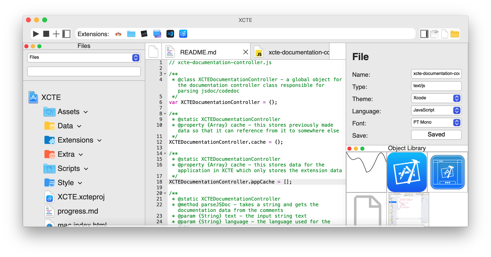
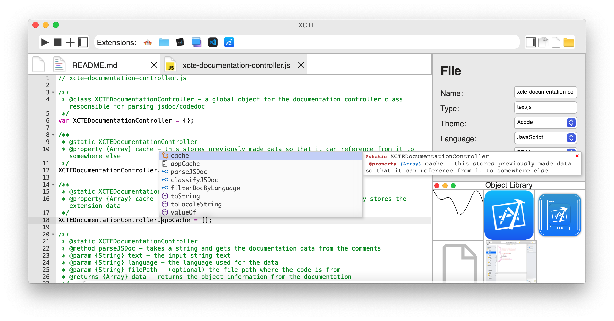
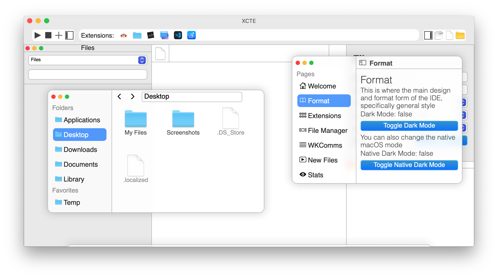
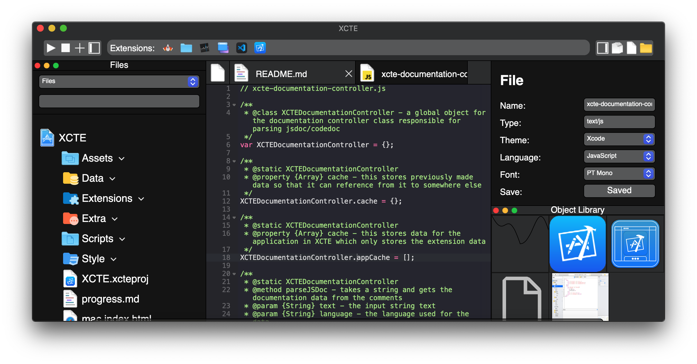

# XCTE:



This is an IDE inspired by Xcode that I created and used for all of my personal programming projects. This IDE includes a multitude of different features including a source code editor, code completion, file management, compilation, and external extensions.

*Notice: The code for this project is not available. Snippets of code to show structure may be available but this project is purely for portfolio purposes. I do not intend to release the code publically.*

## How to run:

Currently, the project is built on a separate runner made in Swift with Xcode for macOS that extracts HTML and JavaScript files to run the user interface of the IDE.

*Note: I'm also currently implementing a Windows version using C# with file system functions however it is not currently complete.*

## Background:

I created this project in high school on a computer I was given. At the time, there weren't many options for me to code with other than the Chrome developer tools and a few text editors. I was curious about learning how IDEs worked and I started by creating my own IDE until it expanded to what it is today. This originally started off as a Chrome App but was then eventually ported to macOS when I had the resources to do it.

## How it works:

The IDE primarily operates on the front end of the application through the JavaScript side, however, it also sends signals to the executable (written in either C# or Swift) to handle file processes or external tasks such as compilation.

### Controllers:

The IDE is composed of controller classes that independently manage different sections of the IDE to make sure it works.

* `FileDataClass`: This controller manages the central files of the entire IDE, meaning:
  * caching data paths
  * file formats
  * file reading
  * file writing
  * reading and updating directories
  * background file clean-up
* `XCTENewFileController`: This controller is responsible for allowing new files to be created with different file formats.
* `XCTESourceKitController`: This controller is the central section that allows code completion to work through communicating through binaries or by using [TernJS](https://ternjs.net/).
* `XCTEDocumentationController`: This class when used extracts all possible [JSDoc](https://jsdoc.app/) code documentation found within the IDE and caches it so it can use it elsewhere.
* `XCTERunnerController`: This class extracts and sets up all the possible files that it can run and compile such as C++, Java, Javascript, etc.
* `XCTENavigationController`: This controller allows the navigation to be expandable to add different features such as search.
* `XCTEHeaderTabsController`: This class manages all the files that are actively used by the IDE and stores them in the header to allow the user to manage through them.
* `XCTEExtensionController`: This controller is central to the expandability of this application to allow extensions for file reading, writing, mini-applications, and chrome-styled extensions to run.
* `XCTEProjectController`: This class provides analysis for `.xcteproj` files in order to manage certain features in the IDE such as documentation, snippets, or others.
* `XCTENotificationController`: This allows notifications to be sent from the IDE if a task has been completed or an internal error occurred.
* `XCTESnippetsController`: This controller allows the source code editor to use different snippets including the ability to read Visual Studio Code snippets.
* `XCTECommunicationsController`: The class that handles all the communications between the front end of the IDE and the runner of the IDE.

### Application Structure:

As previously stated, the central layers of this IDE include a runner, the front end, and external tasks. The runner is used primarily to allow operating system capabilities and to have the GUI run with HTML and Javascript.

#### Runner:

On macOS, the runner is composed of the `WKWebView` from the `WebKit` package and uses the `WKScriptMessageHandler` delegate class. Once a message is received, it redirects it to the `XCTECommunicationsController` class in Swift to manage it 

```swift
// Here's a truncated version of the ViewController class
  
class ViewController: NSViewController, WKNavigationDelegate, WKScriptMessageHandler {
  
  // truncated: ...
  
  func userContentController(_ userContentController: WKUserContentController, didReceive message: WKScriptMessage) {
    // when it receives a callback
    
    XCTECommunicationsController.runCommunications(name: (message.name as? String)!, data: (message.body as? String)!, webView: webView)
    // It runs it with the name and message
    
  }
  
  // truncated: ...
  
}
```

Originally, the Chrome OS version didn't require a runner because the [Chrome Apps Development Tools](https://chrome.google.com/webstore/detail/chrome-apps-extensions-de/ohmmkhmmmpcnpikjeljgnaoabkaalbgc) already managed that with the prebuilt API.

On Windows (not currently complete), it's using the `WebView2` from the `Microsoft.Web.WebView2` module in Visual Studio.

#### User Interface:

The central user interface is built on the library HTML-Advanced which is a client side JavaScript component library similar to react. It's composed of two central elements called `xcte-header` and `xcte-body` that are each composed of different premade elements to unite all the GUI sections in the IDE.

```javascript
// Here's the HTML for the `xcte-header` element

HTMLAdvanced.addNewTag("xcte-header", `
  <div id="header">
    <xcte-header-code-buttons></xcte-header-code-buttons>
    <div id="xcte-header-extension">
      <span>
        Extensions:
      </span>
    </div>
    <xcte-header-file-buttons></xcte-header-file-buttons>
  </div>
`);

// NOTE: the 'xcte-header-file-buttons' and the 'xcte-header-code-buttons' are both custom elements made in the IDE
```

### File System:

The central file system of the IDE uses the FileSystem classes that are structurally inspired by the [Chrome File System API](https://developer.chrome.com/docs/apps/app_codelab_filesystem/) for Chrome apps before it was deprecated.

#### Examples:

To expand the IDE's capabilities after the [Chrome File System API](https://developer.chrome.com/docs/apps/app_codelab_filesystem/), I implement extra methods to add more features to the file system.

##### Classes:
* `NSFileEntry`: The file class to handle paths, reading, and writing (equivalent to: `FileEntry`). 
* `NSDirectoryEntry`: The folder class to handle paths, reading, and writing (equivalent to: `DirectoryEntry`).

Here is a sample of reading a file:

```javascript
var file = new NSFileEntry(path); 
// creates an object to read or write a file from the path
// NOTE: the path inputted as a parameter is not relative

file.readText(data => {
  // to read text from the file you can call this function
  // NOTE: you can change 'readText' to 'readBase64' or 'readUint8' and will get the data accordingly
  
  console.log(data.text);
  // and get the result 
  // NOTE: if using readBase64 or readUint8 then change 'text' to 'base64' or 'uint8'
  
});

// NOTE: the original file.file() from the chrome API is still present but not actively used.
```

Here is a sample of writing a file:

```javascript
file.createWriter((writer)=>{
  // requests to create a writer
  
  writer.onwriteend = ()=>{
    // there is an included callback when completed or failed
    
    console.log("Finished Writing!");
    
  };
  
  var blob = new Blob(["Hello world"]);
  // creates a blob file for the writer to store
  
  writer.write(blob);
  // once this function is called it will write the file
});
```

Here is a sample of creating a folder or reading it:

```javascript
var folder = new NSDirectoryEntry(path); 
// same as the file, the folder is made through the class
// NOTE: the path inputted as a parameter is not relative

var folderReader = folder.createReader();
// to read the folder you would need to create the directory reader class

folderReader.readEntries(function(entries){
  // then you can read the entries and the callback will load the files
  // NOTE: the entries parameter contains an array of both NSFileEntry and NSDirectoryEntry
  
  for (var entry of entries) {
    // loops through all the entries
    
    if (entry.isFile) {
      // to tell if an entry is a file you can use this property
      // NOTE: for directories it's isDirectory
      
      console.log(entry.name);
      // prints the name
      
    }
    
  }
  
});
```

To create a folder:

```javascript
var folder2 = new NSDirectoryEntry(folder.getNSFullPath() + "a"); 
// get a new NSDirectoryEntry with a different path

folder2.createDirectory(function(){
  // and you can create it by calling this function
  
  console.log("Created a new folder!");
  // you can also add a callback once finished
  
});
```

#### How the File System works:

As previously stated since this was built on the [Chrome File System API](https://developer.chrome.com/docs/apps/app_codelab_filesystem/) I reimplemented the main system called `chrome.fileSystem` and added an extra one named `macos.fileSystem`.

The `chrome.fileSystem` and the `macos.fileSystem` both filter through queues of all the files and folders that are being actively read, written, created and sort out which order a tasks needs to be completed. Once both systems have concluded which process needs to run it sends it to the `XCTECommunicationsController` on the client side which is then received by the `XCTECommunicationsController` on the runner's side.

Once the `XCTECommunicationsController` on the runner's side received the communication, it detects the type of requests and processes it accordingly. Although the `XCTECommunicationsController` has other features such as changing between light and dark mode or extracting file icons, it's primarily used for file management.

## Features:

The IDE as previously stated has many different features that allow it to manage different file types, compilation types, applications and extensions.

### File Types:

The IDE has the ability to process many different file types that are not limited to programming files. It also includes image files, object files, databases and other.

#### Code Completion

The IDE currently supports code completion with documentation for some of the languages including Javascript, Python, Swift, C and C++. I've been researching on implement an [Language Server Protocol](https://microsoft.github.io/language-server-protocol/) to the IDE but it currently just individually sends signals from the `XCTECommunicationsController` class to different binaries stored on my computer or the IDE itself.

Here are images:



#### AI Code Completion:

There is an experimental feature I added that provides code completion based on comments through a markov chain that also analyzes the code that is used in the working directory.


#### Extra File Formats:

The IDE can also read different file types as previously stated. Some of them include zip files, PDF, and an assembly reader.

Here are pictures of some of the files described:


### Compilation Types:

The `XCTERunnerController` allows the IDE the ability to be able to run a multitude of different file types. It operates by interacting with the terminal and sending singals through the `XCTECommunicationsController` to get results for how the program ran. 

Currently available running formats:
* C/C++
* Python
* Java
* Javascript
* HTML
* Swift

Here's a snippet of how the code runner defines a language to run:
```javascript
XCTERunnerController.addFileDefinition("py", function(path){
  // defines "*.py" for the file
  
  XCTECommunicationsController.serve("NSTerminalCommandBin", {
    // runs the terminal command
    
    launchPath: "/usr/bin/python3",
    arguments: [
      path
    ]
    
  }, (data)=>{
    // the callback when the terminal command is complete
    
    data.output.map(text=>XCTERunnerController.addResult(text));
    // sets the output
    
    data.errors.map(text=>XCTERunnerController.addResult(text, XCTERunnerController.ResultType.Error));
    // shows the errors
    
  });
  
});
```


### Applications and Extensions:

The applications and extensions of this IDE are all centrally managed through the `XCTEExtensionController` to add new features to the IDE.

#### Properties and Methods of the class:

Here are the main properties and methods of the class `XCTEExtensionController`:
- `addTemplate`: This adds a template for the extensions to use.
- `extensions`: This is the property for all the extensions stored in the IDE.
- `getExtensionById`: This method receives all the extension data from the IDE.
- `openFileFrame`: This method allows extensions to modify the source code editor.
- `addExtension`: This is the method that lets the IDE add an extension.

*Note: All of these are static methods.*

#### Different Types:

There are 3 central extension types: "file", "application", and "extension".

- "file": modifies the main source code editor to put unique HTML or an iframe to have it allow to read or write different files (Examples are the PDF and Zip).
- "application": A mini application inside the app that simplifies developments
- "extensions": Chrome-styled extensions that serve for simple features or games.

#### Mini Apps:

Here are some of the apps used in the IDE:



## Screenshots:

### App Icon:


### Light Mode:


### Dark Mode:



## Sources:

Research:

* [Caret](https://github.com/thomaswilburn/Caret): Allowed me to first start learning about structuring this project.
* [Visual Studio Code](https://github.com/microsoft/vscode): Allowed me to better understand how IDE's and text editors work.

Libraries: 

* [Ace Editor](https://ace.c9.io/): The central source code editor that provided the foundation of the application.
* [jedi](https://github.com/davidhalter/jedi): A python framework that is used to provide code completion for python.
* [SourceKitten](https://github.com/jpsim/SourceKitten): A swift framework that utilizes SourceKit to provide code completion for swift.
* [TernJS](https://ternjs.net/): A javascript code analyzer to provide code completion.
* [Babel](https://babeljs.io/): open source compiler that allows JSX to be transpiled into javascript which was used for the user interface.
* [Less CSS](https://lesscss.org/): post processing style sheet language to style the application.
* [JSZip](): Allows the IDE to read and write zip files
* [HTMLAdvanced](): The client-side UI framework used to create this.
* [Clang](https://clang.llvm.org/): The C and C++ compiler

IDEs:

* [Chrome App Developer Tools](https://chrome.google.com/webstore/detail/chrome-apps-extensions-de/ohmmkhmmmpcnpikjeljgnaoabkaalbgc): The initial starting form of the application
* [Xcode](https://developer.apple.com/xcode/): The IDE that allowed the macOS version to work.
* [Visual Studio](https://visualstudio.microsoft.com/): The IDE that allowed the windows version to work.
